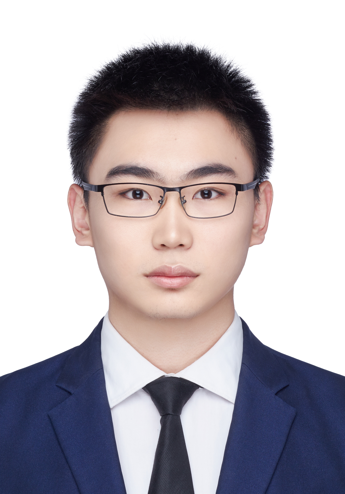
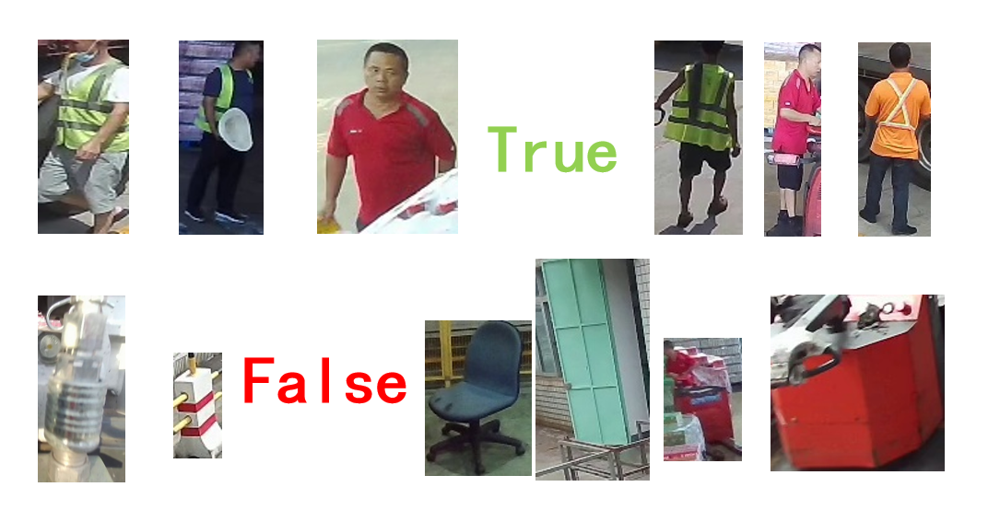
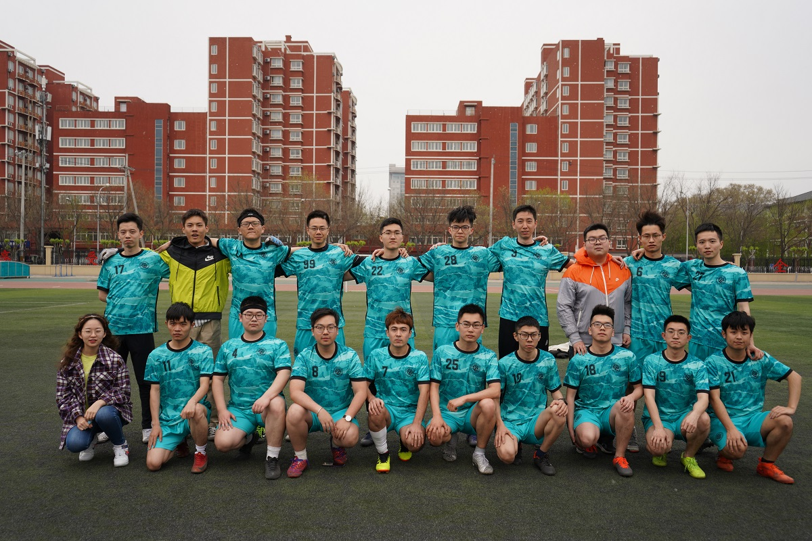

## Welcome to My Pages
<!---
-->
 
**Pengze Li** 
**MSc Computer Graphics, Vision and Imaging** 

I am Pengze Li, a college student from University College London(UCL), majoring in Computer Graphics, Vision and Imaging. My research interest focuses on computer vision (e.g., denoising, image processing, recognition) and its applications in real-world problems.

**E-mail: LINSONNG@163.COM** 

## Educations
**Main education experience** 
Sep. 2022 ~ Sep. 2023 
University College London(UCL), London, UK 
MSc. in Computer Graphics, Vision and Imaging 

Sep. 2018 ~ Jul. 2022 
Beijing University of Posts and Telecommunications (BUPT), Beijing, China 
B.Eng. in Electronic Science and Technology  

Sep. 2015 ~ Jul. 2018 
Beijing 101 Middle School, Beijing, China 

**Short-term education experience** 
Jan. to Feb. 2021, National University of Singapore, Singapore 
Artifical Intelligence and Machine Learning 

Jul. 2019 
Summer school, Loughborough University, Leicester, UK 
STEM lab

## Work Experience
**Image Processing Intern, May. 2021 ~ Jun. 2022**  
_Institute of Automation, Chinese Academy of Science_ 
_Academic Supervisor: _<a target="_blank" href="https://scholar.google.com/citations?user=o8PT69EAAAAJ&hl=zh-CN">Prof. Jian Cheng</a> (Research Fellow), Dr. Chenghua Li_ 

Job Responsibilities: 
* Stay updated with the state-of-the-art computer vision and deep learning algorithms; 
* Implement the model on GPU (RTX TITAN), based on Python and Pytorch; 
* Based on U-Net, focus on real-time denoising algorithm; 
* Design, train, evaluate, tune, accelerate models, one of the results is shown below. 

_The video shows the denoising results given by the convolutional neural network in 0.5 seconds._ 
<video width="360" height="270" controls>
    <source src="snowboard1.mp4" type="video/mp4">
    Your browser does not support the video tag. Maybe try switch to Google Chrome.
</video>

## Research Experience
**High Resolution Aerial Image Road Extraction** 
_Academic Supervisor: Dr. Junli Yang, Sep. 2020 ~ Jun. 2022_  
Road extraction is a fundamental task in the field of remote sensing which has been a hot research topic in the past decade. In the CVPR DeepGlobe Road Extraction Challenge, our team made Multiscale Strip Pooling DLinkNet Enhanced by Channel-wise Attention Mechanism. We also designed the fusion consisting of multiple models, inlcuding **ResNet**, D-LinkNet, SENet, D-block, Transformer, and some other new modules. The work is on the 3090ti server using PyTorch. After adopting the pooling feature map to adapt the narrow-and-slender feature in road extraction tasks, we received expected improvements in IoU scores.  

Regarding this work, a patent is pending and a paper will be sent to Remote Sensing soon. 
<video width="360" height="270" controls>
    <source src="RoadExtraction.mp4" type="video/mp4">
    Your browser does not support the video tag. Maybe try switch to Google Chrome.
</video>
 

**Pedestrian Classification** 
_Academic Supervisor: Dr. Da Guo, Prof. Xile Cao.  Jan. 2022 ~ Jun. 2022_  
This is my graduation project, cooperated with the engineers from <a target="_blank" href="https://www.aidong-ai.com/">Aidong Beyond Artificial Intelligence Technology (Beijing) Co., Ltd.</a>. Taking advantage of the private dataset of pedestrians in the factory provided by Aidong, I processed real industrial datasets and completed a pedestrian recognition model based on **ResNet**, in which **data augmentation** and **SE Module** are applied. The accuracy is greater than 96% (TP+TN)/(TP+FN+FP+TN). Considering the needs of industry, this project ran with TensorFlow.

 

### College Students' Innovative Entrepreneurial Training Plan Programs

The Proper Noun Translator in Thai-and-Chinese Language Based on Python 
_Academic Supervisor: Assoc. Prof. Jianming Huang from Jun. 2020 to May. 2021_ 
* Designed a translator dedicated to translate Thai personal names and geographical names, which mainly contained four modules: Romanization transcription of Thai letters, Roman transcription-Chinese transliteration (corresponded), Dictionary word search and user interface.
* <a target="_blank" href="https://win.bupt.edu.cn/program.do?id=2559">Intranet link</a>

Develop of an Internet Meme Searching & Compositing Tool Based on Crawling and Artificial  
_Academic Supervisor: Prof. Yang Ji from Sep. 2019 to Jul. 2020_ 
* Crawled copyright-free images from different Internet communities, classified and store them in the database. Provided functions of emoji search and use through the WeChat mini program, synthesized pictures and texts, as well as the function of AI face-swap.
* <a target="_blank" href="https://win.bupt.edu.cn/program.do?id=1672">Intranet link</a>

College Campus Outdoor-scene Navigation System Based on Unity 3D 
_Position: Person in Charge ;Academic Supervisor: Yuan Sun from Jun. 2019 to Jul. 2020_ 
* Using Unity 3D, built a 1: 1 real-scene 3D map of BUPT campus for users to virtually visit the Beijing University of Posts and Telecommunications(My university). Users are able to walk in this map and view the scene.
* <a target="_blank" href="https://win.bupt.edu.cn/program.do?id=1179">Intranet link</a>

### Others
Favorite football player: <a target="_blank" href="https://en.wikipedia.org/wiki/Juan_Bernat">Juan Bernat</a> 
I played right back in my college football team(No.25). 
 
